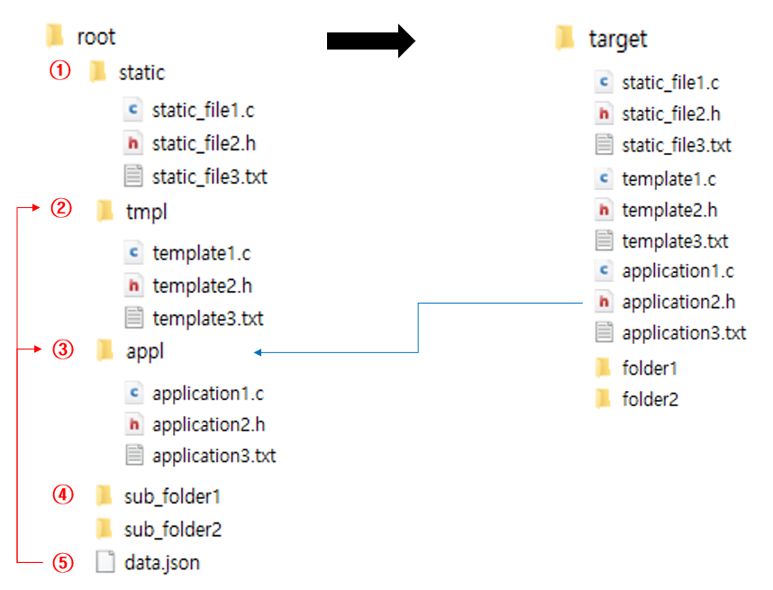

Working Principle
=================

.. toctree::
   :hidden:
   :maxdepth: 2

Folder Structure
----------------

``autogenerator`` 가 다루는 폴더는 위와 같은 구성을 가지고 있어야 한다. 폴더 구성은 크게 5가지로 분류된다.

static
~~~~~~
해당 폴더 하위에 있는 모든 파일을 target 폴더로 단순히 복사한다.

tmpl
~~~~
해당 폴더 하위에 있는 모든 파일은 ``data.json`` 을 참조하여 템플릿이 처리된 후 target 폴더로 복사된다. 템플릿 엔진은 `Jinja2 <https://jinja.palletsprojects.com/en/2.10.x/>`_ 를 사용한다.

예를 들어, ``data.json`` 과 ``root/tmpl/template1.c`` 가 다음과 같이 구성되어 있다면,

**data.json**

.. code-block::

	{
		"title" : "Hello, world!",
		"list" : [1, 2, 3, 4]
	}

**root/tmpl/template1.c**

.. code-block:: c

	#include <stdio.h>

	int main(){
		printf("{{ data.title }}\n");

		
		printf("{{ i }}\n");
		
		return 0;
	}

결과물인 ``target/template1.c`` 는 다음과 같은 결과가 나온다.

**target/template1.c**

.. code-block:: c

	#include <stdio.h>

	int main(){
	        printf("Hello, world!\n");
	        printf("1\n");
	        printf("2\n");
	        printf("3\n");
	        printf("4\n");
	        return 0;
	}

appl
~~~~
해당 폴더 하위에 있는 모든 파일은 ``data.json`` 파일 및 target 폴더 내, 동일 파일을 참조하여 템플릿 처리된 후 target 폴더로 복사된다.

sub_<folder>
~~~~~~~~~~~~
``sub_`` 접두어가 붙은 모든 폴더는 동일한 방식으로 재귀적으로 처리된 후, target 폴더에 접두어가 제거된 상태로 복사된다.

data.json
~~~~~~~~~
템플릿에 참조되는 자료들을 JSON 형태로 구성해 놓은 데이터 파일.
